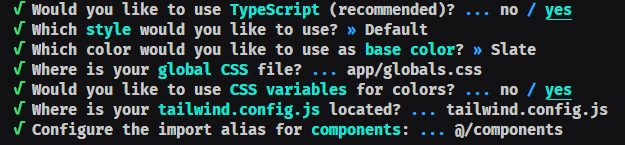

# Starting the project with NEXT.JS

## What is Next.js?

Next.js is a React framework that allows us to build server-side rendered React
applications. It is a framework that is built on top of React and Node.js
and it is used to build production-ready, full-stack React applications.

## Why Next.js?

Next.js is a framework that is built on top of React and Node.js and it is us
ed to build production-ready, full-stack React applications. It is a React framework
that allows us to build server-side rendered React applications.

## How to create a Next.js project?

To create a Next.js project, we can use the following command:

```bash
npx create-next-app@latest
```

## Using ShadcnUi with Next.js

To use ShadcnUi with Next.js, we need to install the following dependencies:

```bash
npx shadcn-ui@latest init
```

Some configs:

<h1 align="left">
    
</h1>

## After install ShadcnUi, you can use the following commands to add a component:

```bash
npx shadcn-ui@latest add `any-component-name`
```

or

```bash
npx shadcn-ui@latest add
```

And select the component you want to add.
